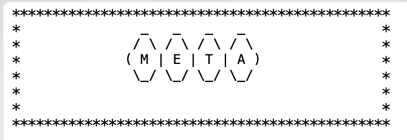
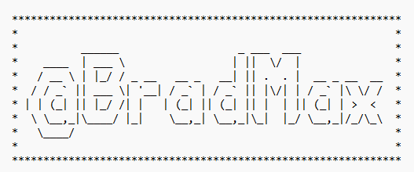
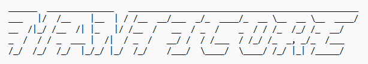

# go-infostealer-parser

Detects and parses infostealer.

## Installation

```bash
go get -u github.com/anhnmt/go-infostealer-parser
```

## Usage

```go
package main

import (
	"fmt"
	"log"

	"github.com/anhnmt/go-infostealer-parser/parser"
)

func main() {
	// Parse infostealer logs from a compressed archive
	results, err := parser.Parser("stealer_logs.zip", "./output_dir")
	if err != nil {
		log.Fatalf("failed to parse: %v", err)
	}

	// Iterate over extracted data
	results.Range(func(key string, stealer *parser.InfoStealer) bool {
		fmt.Printf("Group: %s\n", key)
		if stealer.UserInfo != nil {
			fmt.Printf("  IP: %s | OS: %s | Machine: %s\n", stealer.UserInfo.IP, stealer.UserInfo.OS, stealer.UserInfo.MachineName)
		}
		for _, cred := range stealer.Credentials {
			fmt.Printf("  [Cred] %s -> %s (%s)\n", cred.URL, cred.Username, cred.Application)
		}
		return true
	})
}
```

## Supports

- Group Meta
  - META

    
  
  - REDLINE
  
    
  
  - BRADMAX
  
    
  
  - MANTICORE
  
    

- Group Unknown
  - Stealers that we cannot identify.

## References

- https://github.com/milxss/universal_stealer_log_parser
- https://github.com/lexfo/stealer-parser
